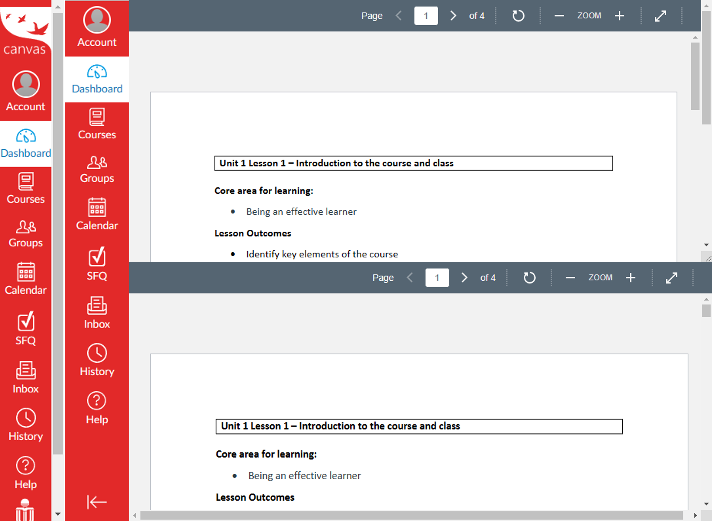

# Canvas Mods
A collection of JavaScript modifications for quality-of-life improvements

# Canvas-9S
9S is the most advanced Scanner[^1][^2]

Downloads all files of a course with one click

## Usage

- Install [Custom Javascript for Websites 2](https://chrome.google.com/webstore/detail/custom-javascript-for-web/ddbjnfjiigjmcpcpkmhogomapikjbjdk) Extension
  - For Firefox, you may need to find something else yourself. 
- Navigate to Canvas, click the extension icon, and paste `Canvas-9S.js`. __Press save.__
- On Canvas, open a course and navigate to the `Files` page
- What used to be `All My Files` at the bottom shall now be `Find 9S for help`. Click it. 
- _Be patient and wait for the slow HKUST server._
- File will be automatically downloaded when ready
  - May need to accept `allow multiple downloads` permission on browser
  
[^1]: I hope you get the naming reference. 
[^2]: There is no competing product. 

# Canvas-CSS

Fixes
- Scrollbar in navbar
- Nested vertical scrollbar in file preview dialog

